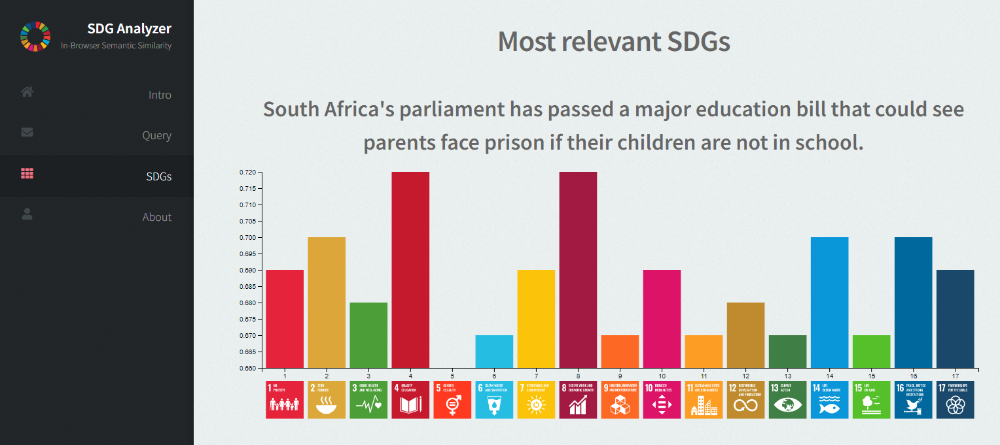

# SDG-Analyzer
Frontend-only semantic similarity mapper for SDGs.

References
- [https://github.com/do-me/SDG](https://github.com/do-me/SDG) for recent SGD (target) data
- [SemanticFinder](https://do-me.github.io/SemanticFinder/) for the know-how 
- [transformers.js](https://github.com/xenova/transformers.js) for running machine learning models fully in the browser without server
- [jinaai/jina-embeddings-v2-base-en](https://huggingface.co/jinaai/jina-embeddings-v2-base-en) for embeddings (a quantized version for smaller size [Xenova/jina-embeddings-v2-base-en](https://huggingface.co/Xenova/jina-embeddings-v2-base-en))
- [d3](https://d3js.org/) for the bar chart

Data 
- [SDG_Target_2023_jina_base.json.gz](https://github.com/do-me/SDG-Analyzer/blob/main/assets/SDG_Target_2023_jina_base.json.gz)
- [SDG_Qdrant.snapshot](https://github.com/do-me/SDG-Analyzer/blob/main/SDG_Qdrant.snapshot)

Also try [qdrant-frontend](https://do-me.github.io/qdrant-frontend/) to analyze the data!
